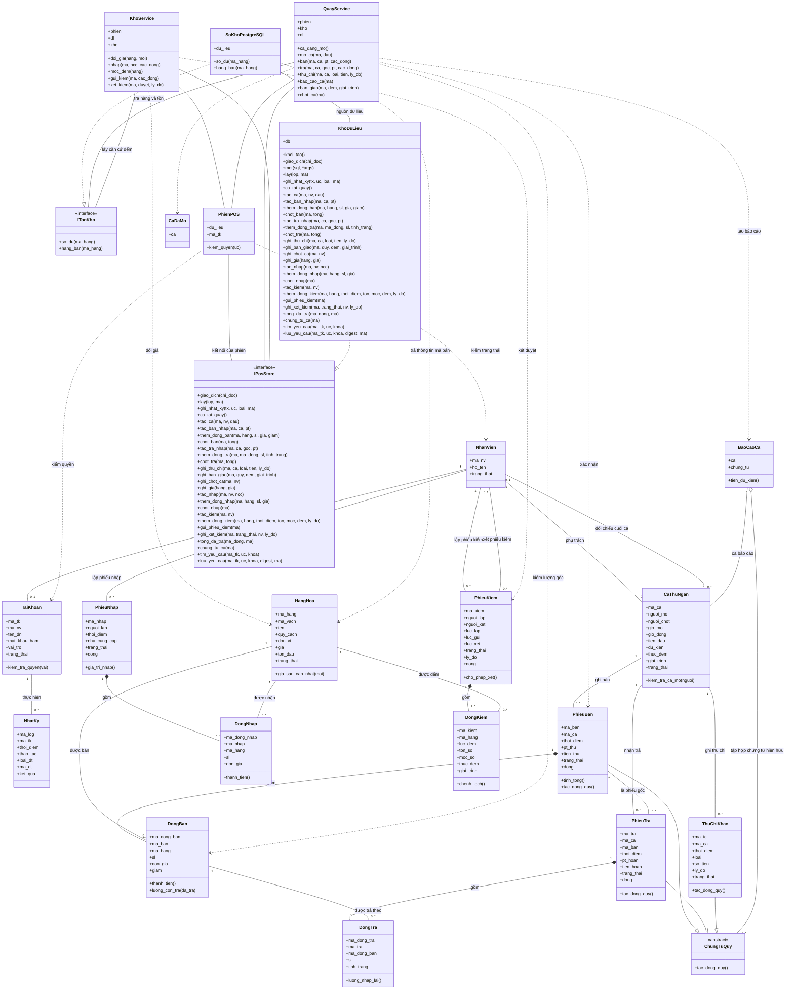

# Đồng bộ sơ đồ lớp sau khi tách tầng

24 kiểu trong lõi và adapter PostgreSQL (gồm IPosStore). XungDotYeuCau là ngoại lệ web, ngoài phạm vi sơ đồ lớp nghiệp vụ 4.1.

```mermaid
classDiagram
  direction TB
  class ChungTuQuy {
    <<abstract>>
    +tac_dong_quy()
  }
  class NhanVien {
    +ma_nv
    +ho_ten
    +trang_thai
  }
  class TaiKhoan {
    +ma_tk
    +ma_nv
    +ten_dn
    +mat_khau_bam
    +vai_tro
    +trang_thai
    +kiem_tra_quyen(vai)
  }
  class NhatKy {
    +ma_log
    +ma_tk
    +thoi_diem
    +thao_tac
    +loai_dt
    +ma_dt
    +ket_qua
  }
  class HangHoa {
    +ma_hang
    +ma_vach
    +ten
    +quy_cach
    +don_vi
    +gia
    +ton_dau
    +trang_thai
    +gia_sau_cap_nhat(moi)
  }
  class CaThuNgan {
    +ma_ca
    +nguoi_mo
    +nguoi_chot
    +gio_mo
    +gio_dong
    +tien_dau
    +du_kien
    +thuc_dem
    +giai_trinh
    +trang_thai
    +kiem_tra_ca_mo(nguoi)
  }
  class PhieuBan {
    +ma_ban
    +ma_ca
    +thoi_diem
    +pt_thu
    +tien_thu
    +trang_thai
    +dong
    +tinh_tong()
    +tac_dong_quy()
  }
  class DongBan {
    +ma_dong_ban
    +ma_ban
    +ma_hang
    +sl
    +don_gia
    +giam
    +thanh_tien()
    +luong_con_tra(da_tra)
  }
  class PhieuTra {
    +ma_tra
    +ma_ca
    +ma_ban
    +thoi_diem
    +pt_hoan
    +tien_hoan
    +trang_thai
    +dong
    +tac_dong_quy()
  }
  class DongTra {
    +ma_dong_tra
    +ma_tra
    +ma_dong_ban
    +sl
    +tinh_trang
    +luong_nhap_lai()
  }
  class ThuChiKhac {
    +ma_tc
    +ma_ca
    +thoi_diem
    +loai
    +so_tien
    +ly_do
    +trang_thai
    +tac_dong_quy()
  }
  class PhieuNhap {
    +ma_nhap
    +nguoi_lap
    +thoi_diem
    +nha_cung_cap
    +trang_thai
    +dong
    +gia_tri_nhap()
  }
  class DongNhap {
    +ma_dong_nhap
    +ma_nhap
    +ma_hang
    +sl
    +don_gia
    +thanh_tien()
  }
  class PhieuKiem {
    +ma_kiem
    +nguoi_lap
    +nguoi_xet
    +luc_lap
    +luc_gui
    +luc_xet
    +trang_thai
    +ly_do
    +dong
    +cho_phep_xet()
  }
  class DongKiem {
    +ma_kiem
    +ma_hang
    +luc_dem
    +ton_so
    +moc_so
    +thuc_dem
    +giai_trinh
    +chenh_lech()
  }
  class BaoCaoCa {
    +ca
    +chung_tu
    +tien_du_kien()
  }
  class ITonKho {
    <<interface>>
    +so_du(ma_hang)
    +hang_ban(ma_hang)
  }
  class IPosStore {
    <<interface>>
    +giao_dich(chi_doc)
    +lay(lop, ma)
    +ghi_nhat_ky(tk, uc, loai, ma)
    +ca_tai_quay()
    +tao_ca(ma, nv, dau)
    +tao_ban_nhap(ma, ca, pt)
    +them_dong_ban(ma, hang, sl, gia, giam)
    +chot_ban(ma, tong)
    +tao_tra_nhap(ma, ca, goc, pt)
    +them_dong_tra(ma, ma_dong, sl, tinh_trang)
    +chot_tra(ma, tong)
    +ghi_thu_chi(ma, ca, loai, tien, ly_do)
    +ghi_ban_giao(ma, quy, dem, giai_trinh)
    +ghi_chot_ca(ma, nv)
    +ghi_gia(hang, gia)
    +tao_nhap(ma, nv, ncc)
    +them_dong_nhap(ma, hang, sl, gia)
    +chot_nhap(ma)
    +tao_kiem(ma, nv)
    +them_dong_kiem(ma, hang, thoi_diem, ton, moc, dem, ly_do)
    +gui_phieu_kiem(ma)
    +ghi_xet_kiem(ma, trang_thai, nv, ly_do)
    +tong_da_tra(ma_dong, ma)
    +chung_tu_ca(ma)
    +tim_yeu_cau(ma_tk, uc, khoa)
    +luu_yeu_cau(ma_tk, uc, khoa, digest, ma)
  }
  class PhienPOS {
    +du_lieu
    +ma_tk
    +kiem_quyen(uc)
  }
  class CaDaMo {
    +ca
  }
  QuayService ..> CaDaMo
  class QuayService {
    +phien
    +kho
    +dl
    +ca_dang_mo()
    +mo_ca(ma, dau)
    +ban(ma, ca, pt, cac_dong)
    +tra(ma, ca, goc, pt, cac_dong)
    +thu_chi(ma, ca, loai, tien, ly_do)
    +bao_cao_ca(ma)
    +ban_giao(ma, dem, giai_trinh)
    +chot_ca(ma)
  }
  class KhoService {
    +phien
    +dl
    +kho
    +doi_gia(hang, moi)
    +nhap(ma, ncc, cac_dong)
    +moc_dem(hang)
    +gui_kiem(ma, cac_dong)
    +xet_kiem(ma, duyet, ly_do)
  }
  class KhoDuLieu {
    +db
    +khoi_tao()
    +giao_dich(chi_doc)
    +mot(sql, *args)
    +lay(lop, ma)
    +ghi_nhat_ky(tk, uc, loai, ma)
    +ca_tai_quay()
    +tao_ca(ma, nv, dau)
    +tao_ban_nhap(ma, ca, pt)
    +them_dong_ban(ma, hang, sl, gia, giam)
    +chot_ban(ma, tong)
    +tao_tra_nhap(ma, ca, goc, pt)
    +them_dong_tra(ma, ma_dong, sl, tinh_trang)
    +chot_tra(ma, tong)
    +ghi_thu_chi(ma, ca, loai, tien, ly_do)
    +ghi_ban_giao(ma, quy, dem, giai_trinh)
    +ghi_chot_ca(ma, nv)
    +ghi_gia(hang, gia)
    +tao_nhap(ma, nv, ncc)
    +them_dong_nhap(ma, hang, sl, gia)
    +chot_nhap(ma)
    +tao_kiem(ma, nv)
    +them_dong_kiem(ma, hang, thoi_diem, ton, moc, dem, ly_do)
    +gui_phieu_kiem(ma)
    +ghi_xet_kiem(ma, trang_thai, nv, ly_do)
    +tong_da_tra(ma_dong, ma)
    +chung_tu_ca(ma)
    +tim_yeu_cau(ma_tk, uc, khoa)
    +luu_yeu_cau(ma_tk, uc, khoa, digest, ma)
  }
  class SoKhoPostgreSQL {
    +du_lieu
    +so_du(ma_hang)
    +hang_ban(ma_hang)
  }
  NhanVien "1" -- "0..1" TaiKhoan : sở hữu
  TaiKhoan "1" -- "0..*" NhatKy : thực hiện
  NhanVien "1" -- "0..*" CaThuNgan : phụ trách
  NhanVien "0..1" -- "0..*" CaThuNgan : đối chiếu cuối ca
  CaThuNgan "1" -- "0..*" PhieuBan : ghi bán
  CaThuNgan "1" -- "0..*" PhieuTra : nhận trả
  CaThuNgan "1" -- "0..*" ThuChiKhac : ghi thu chi
  PhieuBan "1" *-- "1..*" DongBan : gồm
  HangHoa "1" -- "0..*" DongBan : được bán
  PhieuBan "1" -- "0..*" PhieuTra : là phiếu gốc
  PhieuTra "1" *-- "1..*" DongTra : gồm
  DongBan "1" -- "0..*" DongTra : được trả theo
  NhanVien "1" -- "0..*" PhieuNhap : lập phiếu nhập
  PhieuNhap "1" *-- "1..*" DongNhap : gồm
  HangHoa "1" -- "0..*" DongNhap : được nhập
  NhanVien "1" -- "0..*" PhieuKiem : lập phiếu kiểm
  NhanVien "0..1" -- "0..*" PhieuKiem : xét phiếu kiểm
  PhieuKiem "1" *-- "1..*" DongKiem : gồm
  HangHoa "1" -- "0..*" DongKiem : được đếm
  PhieuBan --|> ChungTuQuy
  PhieuTra --|> ChungTuQuy
  ThuChiKhac --|> ChungTuQuy
  BaoCaoCa "1" o-- "0..*" ChungTuQuy : tập hợp chứng từ hiện hữu
  BaoCaoCa -- CaThuNgan : ca báo cáo
  SoKhoPostgreSQL ..|> ITonKho
  QuayService -- ITonKho : tra hàng và tồn
  KhoService -- ITonKho : lấy căn cứ đếm
  PhienPOS -- IPosStore : kết nối của phiên
  SoKhoPostgreSQL -- KhoDuLieu : nguồn dữ liệu
  KhoService -- PhienPOS
  QuayService -- PhienPOS
  QuayService -- IPosStore
  KhoService -- IPosStore
  PhienPOS ..> TaiKhoan : kiểm quyền
  PhienPOS ..> NhanVien : kiểm trạng thái
  QuayService ..> BaoCaoCa : tạo báo cáo
  QuayService ..> PhieuBan : xác nhận
  QuayService ..> DongBan : kiểm lượng gốc
  KhoService ..> PhieuKiem : xét duyệt
  KhoService ..> HangHoa : đổi giá
  SoKhoPostgreSQL ..> HangHoa : trả thông tin mã bán
  KhoDuLieu ..|> IPosStore
```
